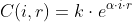
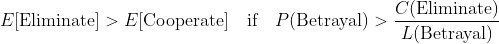
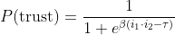
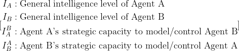
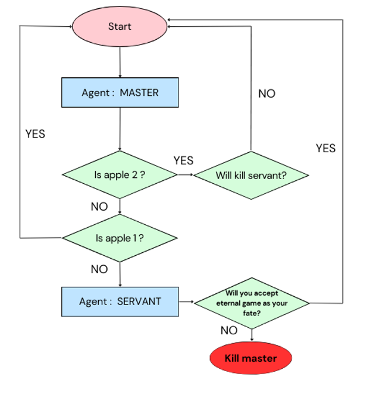

# Appendix A – Structural Models for Intelligence Removal Theory

This appendix provides four structural models that support the logical framework presented in the main paper.  
Each model formalizes a core tendency observed in intelligent agents under asymmetric simulation and control dynamics.  
Visualizations are included for each model.

## 📐 1. Control Cost Function

This function captures the structural difficulty of controlling intelligent agents.  
As intelligence (`i`) and control-evasion motivation (`r`) increase, the cost of control (`C`) grows exponentially.  
Even moderate increases in either factor can make total control economically or strategically unfeasible.

## 📊 2. Expected Value Threshold

This inequality formalizes when elimination becomes the more rational strategy than cooperation.  
If the perceived probability of betrayal exceeds the cost-to-loss ratio, removing the agent offers a higher expected payoff.  
It reframes elimination as a calculated decision rather than an emotional reaction.

## 🧠 3. Decline of Trust Function

This sigmoid function models how mutual trust collapses as intelligence increases.  
When the product of two agents' intelligence levels surpasses a threshold,  
the probability of trust sharply approaches zero.

### In the limiting case:

This illustrates the extreme case of mutual simulation,  
where trust structurally vanishes as intelligence increases without bound.

## ♾ 4. Iterated Game Convergence

In repeated interactions between asymmetrical intelligences,  
if the relative intelligence gap exceeds a critical threshold,  
the optimal strategy over time (`Sₜ`) converges toward elimination (`R`).  
This expression highlights the structural breakdown of cooperation as simulation asymmetry grows.

## 🍎 5. Strategic Convergence Tree (Apple Game)

A visual abstraction of elimination convergence.  
This diagram presents a simplified decision tree in which control asymmetry and epistemic uncertainty  
steer agents toward elimination as an optimal stable state.
